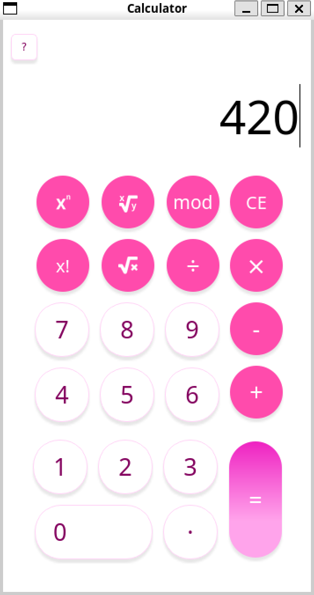

Name
---------

NGLYD Calculator

Description
---------

NGLYD Calculator has been created as a project for IVS course at Faculty of Information Technology, Brno University of Technology.
It supports basic instructions, such as: +, -, *, /,
            and some advanced instructions: nth power, square root, nth root, factorial, modulo.
You can operate it using buttons in GUI, or using your keyboard.
For more information refer to our user documentation.

Screenshot
---------

Environment
---------

Ubuntu 64bit

Authors
------

NGLYD
- xfignam00 Matúš Fignár 
- xmalegt00 Tibor Malega 
- xnovakf00 Filip Novák 
- xskovaj00 Ján Skovajsa 

License
-------

This programm is licensed under the GNU General Public License v3.0
